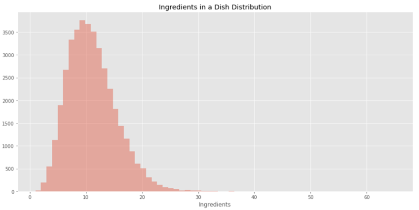
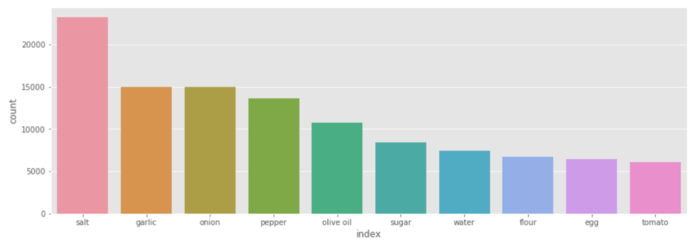
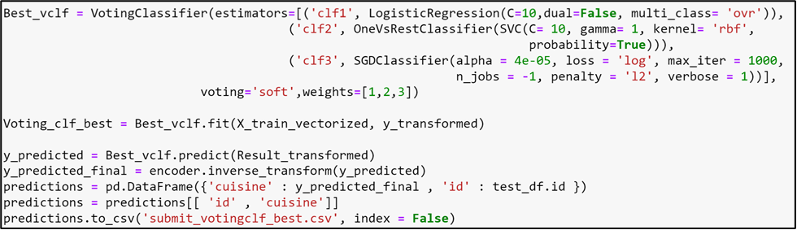

# What’s Cooking? (Kaggle Competition)

## 1.1	Background and Objective
What’s Cooking is a competition hosted by Kaggle. In this competition, we need to predict the category of a dish’s cuisine based on the dish’s ingredients. The dataset is provided by Yummly. The provided dataset includes recipe id, the type of cuisine, and the ingredients required for cooking that recipe. The data is stored in JSON format. The objective of this competition is to train a machine learning algorithm that can predict the type of cuisine by using the ingredients of that cuisine. Looking at the problem statement, we can understand that the given task is a Multi-class classification i.e., there are more than 2 categories to predict. This multi-class classification would require text processing and analysis.

Based on my preliminary analysis, I think that classification algorithms like SGD classifier, Logistic Regression, and Neural Networks would be a good choice of algorithms for predicting multiple categories. Also, we can use SVMs to predict the classes by converting the given problem into one vs all classes problem.

## 1.2	Data Description
As mentioned earlier, the dataset is provided by Yummly has different recipes in different rows. The training dataset has 39774 different recipes, while the test dataset has only 9944 different recipes. Also, the dataset has three attributes:
1. Id: This is a unique identifier for each recipe.
2. Cuisine: This column contains the cuisine type of each recipe. This is our target variable, as we need to predict this in the test dataset.
3. Ingredients: This column contains a list of ingredients required for each dish. We would use this column to train our machine learning algorithm and predict target variable.

## 1.3	Exploratory Data Analysis and Data Pre-Processing

### EDA
Now, let’s jump onto the exploratory data analysis and try to identify important patterns and extract valuable insights from the dataset. These insights would help us design our strategies to pre-process the text given in the column ‘ingredients’. Since, the dataset did not have any missing or null values so, we don’t have to deal with any missing values.

There are 20 unique cuisines in the training dataset. These cuisines along with their distribution, in terms of count, is shown in the figure below:

**Figure 1: Bar graph showing distribution of Cuisines vs Count**

We can see from the above bar graph that majority of the recipes given in the training dataset belongs to either ‘Italian’ or ‘Mexican’ cuisines. Hence, we can conclude that our dataset is imbalanced. Now, let us look at the distribution of ingredient lengths. 

Before doing some more analysis, let us first perform the data cleaning on the train and test dataset to remove unwanted strings and special characters (discussed in next section).
After the data cleaning, let us check what are the top ingredients in all cuisines. 

### Data Pre-Processing (Data Cleaning)

We can divide our data cleaning into 8 categories. They are listed below:
1. Special Character Exceptions: After going through the train and test datasets, I found that there are certain special words/characters that we would need to remove first before applying any other data cleaning because then we would not be able to spot those special words/characters in the datasets. Some of these special words are ‘\xada’, ‘ã’, etc. 
2. Certain Phrases: In the train and test datasets, I identified that there are some words that have similar meaning but are written in different forms e.g., "sun dried" and "sundried" are same. Hence, we can replace one of to another so that there is no discrepancy in the datasets. 
3. Handling Plural Words: In the train and test datasets, there are so many ingredients with their plural forms. Hence, we identified some of those and replaced those since they mean the same ingredients. For example, "drumsticks" and "drumstick".
4. Brand Names: This step was very important because the other text processing techniques can not remove brand names associated with the ingredients in the datasets. I could not identify any other automated method to identify and remove them so, I did it manually. Fortunately, I identified one kernel [1] that had mentioned almost every brand name in the datasets; however, some of them were still missing, so I added them in the code. Some of the brand names associated with the ingredients are kraft, and Tabasco. 
5. Unnecessary Keywords: There were a lot of unnecessary keywords associated with the ingredients in the train and test datasets. These keywords could be removed without the loss of any important information. Some of the examples of these keywords are “drained and chopped”, “thawed”, “firmly packed”, etc.
6. Measurements: I also removed the measurements associated with different ingredients. 
7. Phrases with Similar Meaning: There are a lot of ingredients mentioned with different names but can be replaced with the one main ingredient e.g., “green onion”, "red onion",  and "purple onion" can be replaced with “onion” since they are the same ingredients.
8. Usual Special Characters: Finally, removing the usual special characters in the datasets with space or “no space”.

### Count Vectorizer and TF-ID Vectorizer

Both Count Vectorizer and TFID Vectorizers are the methods for converting the textual data into numerical feature vectors such that these vectors having numerical values can then be used to model machine learning algorithms. Count Vectorizer is a simple vectorizer that converts the textual data into vectors by counting the number of times a word has appeared in the document. Hence, Count Vectorizers are not suitable for a dataset with imbalanced word counts as it gives bias to the most frequent words, ultimately ignoring the rare words.
On the other hand, TFID Vectorizer also converts the textual data into vectors but instead of taking the count of words into account, it considers overall weightage of the word in the document and ultimately helps us to handle rare words present in the documents as well. This could be the main reason why Count Vectorizer did not perform well on this dataset while we could get a way better Kaggle score with TFID Vectorizer.

#### Count Vectorizer

For training our model with Count Vectorizer, I first separated each ingredient by a pipeline i.e., '|' and then for the ‘token_pattern’ parameter of the Count Vectorizer used the pipeline as the separator. By doing so, the count vectorizer considered each ingredient as an individual word (i.e., it considered ‘black olives’ as one ingredient instead of considering two different ingredients ‘black’ and ‘olives’). For the parameter ‘vocabulary’ I used the complete set of ingredients present the training dataset. I made the ‘binary’ parameter as True since, I needed that all non-zero ingredient count should be labeled as 1.  I did not use any other parameter such as “stop_words” or “ngram_range” as they were not required for the current problem. 
With these parameters, I created a vectorized matrix with columns as vectorized features and rows as the number of dishes. Then instead of using this matrix for modelling, I created a sparse matrix from the vectorized matrix by using library csr_matrix from Scipy Sparse. The csr_matrix converts the vectorized matrix into sparse matrix this makes the processing and training very fast.
After training a random forest with best grid searched parameters, I could only score 0.69569 on Kaggle. This score was not satisfactory. So, I decided to move to TFID Vectorizer.

#### TFID Vectorizer

For training with TFID Vectorizer, I used the default parameters of the vectorizer with default value of ‘token_pattern’ and the default value range of parameter ‘ngram_range’ i.e, (1, 1). Default values of the ‘token_pattern’ and ‘tokenizer’ means that my ingredients would be divided on the basis of each word. Also, ‘ngram_range’ of (1, 1) means that only unigrams would be extracted from the ingredients list. This does make sense since we do not need n-grams for this problem statements. For TFID vectorizer, I did not use any stop words as well. Also, very important to mention, I have taken the ‘binary’ parameter as True, this does not mean that the outputs will only have 0/1 values, instead only the tf-term (i.e., term-frequency) in the tf-idf would be binary. The parameters of TFID Vectorizer are mentioned below:

`TfidfVectorizer(analyzer='word', binary=True, decode_error='strict',
                dtype=<class 'numpy.float64'>, encoding='utf-8',
                input='content', lowercase=True, max_df=1.0, max_features=None,
                min_df=1, ngram_range=(1, 1), norm='l2', preprocessor=None,
                smooth_idf=True, stop_words=None, strip_accents=None,
                sublinear_tf=False, token_pattern='(?u)\\b\\w\\w+\\b',
                tokenizer=None, use_idf=True, vocabulary=None)`
                
                
## Model Training and Hyperparameter Tuning

Now for predicting the target variable, I trained different machine learning models for classification such as Logistic Regression, SVC, SGD Classifier, Neural Networks, Random Forest, Decision Trees, and K-Nearest Neighbors. 

###	K-Nearest Neighbors, Decision Trees, and Random Forest with 10-fold Cross-Validation

At first, I trained my KNNs, Decision Tree, and Random forest with 10-fold cross-validation on the training dataset prepared by Count Vectorizer. 
KNN is a simple and very easy to train supervised machine learning algorithm. In fact, there is no training at all for KNN since, they directly memorize each of the datapoint. When a new datapoint is added to the dataset for prediction, they simply predict the target label of this datapoint based on its neighbors determined by Euclidean Distance (defined by parameter “n_neighbor”). Usually, the value of “n_neighbors” are chosen to be an odd value so that there are no ties while predicting. 
For training the KNN model, I used an arbitrary value of parameter “n_neighbors” as 5 and performed a 10-fold cross-validation on the training dataset. After performing the cross-validation, I could get validation accuracy of 69%. I expected KNN model to perform a little better on the validation set as I thought that the related ingredients would belong to the same cuisines.
Decision Trees are also a simple to implement supervised machine learning algorithm. This algorithm uses a tree-like graph for making simple decision rules for predicting the target variable. Since we had a multi-class classification problem, for training the decision trees, I used the decision tree classifier in combination with the “OnevsRestClassifier” from scikit-learn package. The “OnevsRestClassifier” fits a single classifier per target label.

As expected, the decision tree classifier with ‘one vs rest’ classifier fit the training model very well. After training the model, I got the validation accuracy of 91.7%. However, when I predicted the target labels on the test dataset, the decision trees could give me Kaggle score of 0.60166 (with TFID Vectorizer, refer the main code file named, “EDA, Data Pre-Processing, and Modelling (Best)”). 
Random Forest classifier also performed well on the training dataset. After the training it on the training dataset with 10-fold cross-validation, the validation accuracy was around 93.18%. However, on the test dataset, the algorithm did not perform as expected (even with the tuned hyperparameters) and I could only get a Kaggle Score of 0.58628.

To further inspect the reason behind such a low accuracy, I checked the dataset and predictions. I observed that some to the cuisines have very similar ingredients e.g., British and Irish cuisines have mostly similar ingredients, while Southern US and Mexican cuisines also shared some ingredients. Since, there were a lot of cuisines with very similar ingredients, it would have confused the KNN, DT and even the Random Forest algorithm; hence, leading to a very low validation accuracy.
To improve the score, as already mentioned, I used the TFID Vectorizer instead of Count Vectorizer with other machine learning algorithms.

### 1.4.2	Model Training with TFID Vectorizer

With TFID Vectorizer, I trained the following models:

**Logistic Regression**

Logistic Regression is a classification algorithm that transforms its outputs using logistic sigmoid function to return a probability value and hence, the target label is predicted based on the highest probability. For training the logistic regression, firstly, I transformed the data into a sparse matrix using TFID Vectorizer (already discussed). Then, I split the training dataset into train and validation set by using “train_test_split” library from scikit-learn package. After that, I used the Logistic Regression classifier to fit on the training dataset with arbitrary parameters i.e., C = 10. The ‘C’ parameter in Logistic Regression in called Inverse regularization parameter i.e., lower value of ‘C’ would represent high value of Lambda regulator. So, for a start I choose the value to be 10 (default value is 1).
By training the classifier on my train data set, I got a validation accuracy of ~79.34%. Then I used the same parameters to make the prediction on my test dataset. I got the Kaggle score of ~78.75. This score was way better than DT, KNN and Random Forest in the above section.

**SVC – Support Vector Classification**

For my second model, I used the Support Vector Classification (SVC) from the Scikit-learn package. The implementation is based on ‘libsvm’. Same as Logistic Regression, the ‘C’ parameter represents the regularization parameter. Along with it, I also changed the parameter ‘gamma’ to 1. Gamma represents the kernel coefficient for the kernel ‘rbf’. On the train and validation dataset, I could a validation accuracy of ~81% while, as expected, SVC classifier performed better than the previous algorithms and I got a Kaggle score of 0.80812, with these arbitrary parameters. With these optimized hyperparameters, I could achieve a Kaggle score of 0.80842, which is slightly better than the arbitrary parameters.

**SGD Classifier**

According scikit-learn, SGD Classifier belongs to a class of Linear Classifiers (SVM) with Stochastic Gradient Descent training. This classifier implements regularized linear models with stochastic gradient descent (SGD) learning. For training my SGD classifier, I used the default parameters and got a Kaggle score of 0.77373 on test dataset. For improving my model, I performed the hyperparameter tuning of ‘alpha’ with a grid search. With these optimized hyperparameters, I could achieve a Kaggle score of 0.78077, which is slightly better than the arbitrary parameters.

**Neural Networks**

Neural Networks are powerful machine learning classifiers. They are set of algorithms, that recognizes patterns. For this problem, I used ‘Keras’, an open source neural network python library that is capable of running on top of TensorFlow. To predict the target labels, I trained Six different neural networks with different architecture i.e., with different nodes, hidden layers, Dropout values, Regularization values, and Early Stopping. However, the performance I could get was from the simplest model i.e., neural network 1. Since, GPU was required to train the nets, I used Google's Collaboratory for training and prediction. 
Let’s discuss the various architectures that I used in more detail below. 

Neural Network 1: In this NN, I used 5 hidden layers with 256 node units at first layer, 512 node units for next four layers, and fully connected layer with 20 node units (equal to number of cuisines). For each first four layers, I used ‘ReLU’ i.e., Rectified Linear Unit, as the activation function. ‘ReLU’ greatly improves the computation speed since, the out this function is either zero or one based on the sign of the variable. For the last dense layer, I used ‘Softmax’ as the activation function. Along with these layers, I also included, Dropouts of 0.5 after every layer except the last fully connected layer i.e., drop every node on each layer with the probability of 0.5. Including dropouts greatly reduces the problem of ‘Overfitting’ in neural networks. For compiling the model, I used ‘categorical cross entropy’ as the loss function and ‘adam’ with default learning rate as the optimizer. While fitting, I used the validation split of 80% training and 20% validation and set the epochs to 100 with a batch size of 95.

Neural Network 2: For this Neural Network, I increased the hidden layers to 6 with 256 units at the first layer, 512 units for next two layers, 1024 units for the fourth and five hidden layers, and finally a fully connected dense layer with 20 units. I kept all the other parameters same as the previous neural network. The motive was to make the neural network more complex with more nodes/weights and hidden layers. However, the Kaggle score on the test dataset did not improve after increasing the complexity. The major reason for this would be that the neural networks are overfitting. 
Neural network 3: Since, the earlier neural networks are overfitting, I tried to increase the dropouts after every layer to drop more nodes at each layer. This would try to reduce the over fitting of the neural networks. However, the performance of these neural networks did not improve.

Neural Network 4 and 5: For model 4 and 5, I introduced a ‘L2 Regularizer’ with the ‘l = 0.001’ to further reduce the overfitting of the model. By including the L2 Regularizer, the training vs test loss graph was smoothened slightly (fig. 5); however, the performance of the neural networks still could not surpass the first neural network. 

Neural Network 6: By observing the training loss vs test loss graph of above Neural networks, I could understand that the difference between the training and test loss increased significantly after 20 epochs. So, I introduced the ‘Early Stopping’ from Keras callbacks package. This allowed me to monitor ‘validation loss’ (referred to as test loss above) and when it did not decrease after 4 epochs it will end the training to avoid further overfitting.

**BEST MODEL**

I could get the best results by feeding my three models i.e., Logistic Regression, SVC, and SGD Classifier to the Voting Classifier from the Scikit-learn package. 
Voting Classifier, fits the clones of the estimators and will output the best prediction on the test dataset based on the parameter ‘voting’. It the parameter ‘voting’ is set as ‘Soft’ then it will predict the target label based on the argmax of the sums of the predicted probabilities. If it set for ‘hard’ it will use the predicted class labels for majority rule voting. I used the following parameters for the Voting Classifier:

