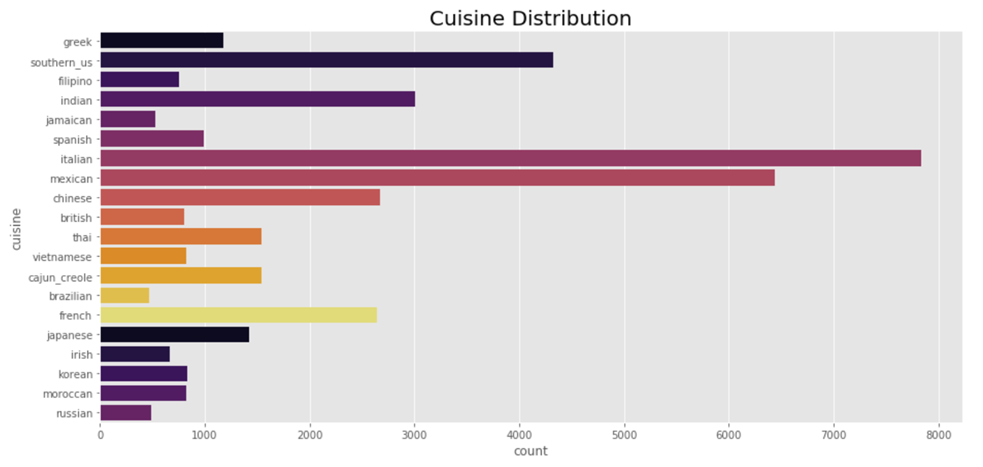

# What’s Cooking? (Kaggle Competition)

## 1.1	Background and Objective
What’s Cooking is a competition hosted by Kaggle. In this competition, we need to predict the category of a dish’s cuisine based on the dish’s ingredients. The dataset is provided by Yummly. The provided dataset includes recipe id, the type of cuisine, and the ingredients required for cooking that recipe. The data is stored in JSON format. The objective of this competition is to train a machine learning algorithm that can predict the type of cuisine by using the ingredients of that cuisine. Looking at the problem statement, we can understand that the given task is a Multi-class classification i.e., there are more than 2 categories to predict. This multi-class classification would require text processing and analysis.

Based on my preliminary analysis, I think that classification algorithms like SGD classifier, Logistic Regression, and Neural Networks would be a good choice of algorithms for predicting multiple categories. Also, we can use SVMs to predict the classes by converting the given problem into one vs all classes problem.

## 1.2	Data Description
As mentioned earlier, the dataset is provided by Yummly has different recipes in different rows. The training dataset has 39774 different recipes, while the test dataset has only 9944 different recipes. Also, the dataset has three attributes:
1. Id: This is a unique identifier for each recipe.
2. Cuisine: This column contains the cuisine type of each recipe. This is our target variable, as we need to predict this in the test dataset.
3. Ingredients: This column contains a list of ingredients required for each dish. We would use this column to train our machine learning algorithm and predict target variable.

## 1.3	Exploratory Data Analysis and Data Pre-Processing

### EDA
Now, let’s jump onto the exploratory data analysis and try to identify important patterns and extract valuable insights from the dataset. These insights would help us design our strategies to pre-process the text given in the column ‘ingredients’. Since, the dataset did not have any missing or null values so, we don’t have to deal with any missing values.

There are 20 unique cuisines in the training dataset. These cuisines along with their distribution, in terms of count, is shown in the figure below:

*Fig. 1: Bar graph showing distribution of Cuisines vs Count*
